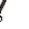
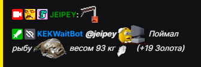
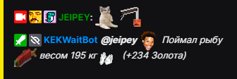
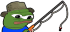
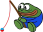

import Tabs from '@theme/Tabs';
import TabItem from '@theme/TabItem';

# Рыбалка

### Описание

Запуская удочку **в воду** есть шанс на поимку рыбы, предметов или мусора, за которые можно получить Золото.

:::danger Важно

Рыбалка во время стрима отключена, не считая активность в воде в виде [**Пузырьков**](/docs/Fishing#пузыри)

:::

## Использование команды
... **`KEKBaited`** ...
 - Команда используеться без ! так-как это эмоут из чата 

 

:::tip Совет

**KEKBaited**  можно использовать в любой части сообщения

:::

 

:::info Можно использовать другие эмоуты
- KEKBaited 
- pepoBaiter 
- fishing 
:::

  

| Global cooldown | 0 seconds⠀⠀⠀⠀⠀⠀⠀⠀⠀⠀⠀|
|:----------------|:----------------------|
| User cooldown   | 70 seconds            |
| Mod only        | No                    |
| Sub only        | No                    |
| Vip only        | No                    |
  

## Модификаторы рыб

**Влияют на количество [Золота](/docs/intro#золото) и [опыта](/docs/intro#опыт-и-лвл) полученого с рыбы.**

`[Обычная]` - Без дополнительных бонусов к Опыту и золоту

`[Ловкая]` - Дополнительный бонус к опыту и малый бонус к золоту

`[Золотая]` - Дополнительный бонус к золоту и малый бонус к опыту

`[Легендарня]` - Большой опыт к золоту и опыту

## Предметы

### Наживка

<Tabs>
  <TabItem value="Черви" label="Черви">

Предмет который можно купить в [магазине](/docs/gold/shop).

Посмотреть **количество** и **выключить** червей можно в [инвентаре](/docs/info/inventory).

:::tip Полностью убирает шанс поймать мусор.
:::

:::tip Черви имеют шанс не потратиться.
:::

:::info Если Черви закончились, рыбу всё ещё можно будет поймать, но с меньшим шансом.
:::

</TabItem>
  <TabItem value="Магнит" label="Магнит">

Предмет который можно купить в [магазине](/docs/gold/shop).

посмотреть **количество** и **выключить** червей можно в [инвентаре](/docs/info/inventory).

:::tip Вместо рыбы ловит с повышеным шансом сокровище и с меньшим мусор.
:::

:::info Если магниты закончились, сокровище всё ещё можно будет поймать, но с меньшим шансом.
:::

</TabItem>
</Tabs>

:::caution Предметы используются сразу после покупки если их не выключить.
Наживки не будут использоваться одновременно.

Приоритет использования предметов **Магнит** > **Черви**
:::

  ## Дополнение

### Пузыри

Раз 1-2 часа появляются пузыри. В течении двух минут после появления пузырей можно поймать особых рыб, с повышенной стоимостью. Так-же пузырьки позволяют ловить рыбу во время стрима.

:::caution Предметы влияющие на шансы, не работают с пузырьками.
:::

:::info Минимальный вес рыбы настроен на 30кг
:::

### Золото и опыт за рыбу

:::note Количество золота за рыбу `(кг * тип рыбы * Модификатор рыбы * Бонусы)`

:::

:::note Количество опыта за рыбы `(кг * тип рыбы * Модификатор рыбы * Модификатор опыта * Бонусы)`

:::

Last update on 07.09.2025