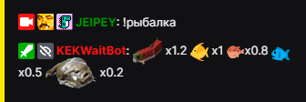

# Рыбалка

### Описание

Запуская удочку **в воду** есть шан на поимку рыбы, предметов или мусора, за которые можно получить Золото.

:::warning Внимание

Рыбалка во время стрима отключена

:::

## Использование комманды
 **`KEKBaited`**

 

:::tip

**KEKBaited** можно использовать в любой части сообщения

:::

## Пример использования
 

  

| Global cooldown | 0 seconds⠀⠀⠀⠀⠀⠀⠀⠀⠀⠀⠀|
|:----------------|:----------------------|
| User cooldown   | 70 seconds            |
| Mod only        | No                    |
| Sub only        | No                    |
| Vip only        | No                    |
  

  ## Дополнение

### Пузыри

Раз 1-2 часа появляются пузыри. В течении одной минуты после появления пузерей можно поймать особых рыб, с повышеной стоимостью. Так-же пузырьки позволяют ловить рыбу во время стрима.

### Стоимость рыбы 

   **`!рыбалка`**

:::note

Стоимость рыбы `(кг * модификатор)`

:::

  

| Global cooldown | 10 seconds⠀⠀⠀⠀⠀⠀⠀⠀⠀⠀⠀|
|:----------------|:----------------------|
| User cooldown   | 10 seconds            |
| Mod only        | No                    |
| Sub only        | No                    |
| Vip only        | No                    |
| Другие варианты комманды        | !стоимость !рыба                    |
  

Last update on 02.09.2023