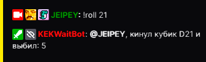

# Кубик и монетка

## Кубик

### Описание

Кинуть кубик с любым значением от 1 до 100.

## Использование команды

 **`!roll amount`**

 - **amount** число от 1 до 100

## Пример использования

  

| Global cooldown | 10 seconds⠀⠀⠀⠀⠀⠀⠀⠀⠀⠀⠀|
|:----------------|:----------------------|
| User cooldown   | 0 seconds            |
| Mod only        | No                    |
| Sub only        | No                    |
| Vip only        | No                    |
| Другие варианты комманды        | !dice !кубик              |
  

## Дополнение

### Монетка

Подкинуть монетку с вариантами да/нет.

 **`!flip`**

## Пример использования

  

| Global cooldown | 10 seconds⠀⠀⠀⠀⠀⠀⠀⠀⠀⠀⠀|
|:----------------|:----------------------|
| User cooldown   | 0 seconds            |
| Mod only        | No                    |
| Sub only        | No                    |
| Vip only        | No                    |
| Другие варианты комманды        | !монетка             |
  

Last update on 04.09.2023
