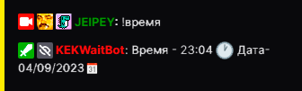

# Время

## Время стрима

### Описание

Узнать сколько прошло времени от стрима.

 **`!uptime`**

  

| Global cooldown | 0 seconds⠀⠀⠀⠀⠀⠀⠀⠀⠀⠀⠀|
|:----------------|:----------------------|
| User cooldown   | 20 seconds            |
| Mod only        | No                    |
| Sub only        | No                    |
| Vip only        | No                    |
  

### Описание

Узнать текущее время по МСК.

 **`!time`**

## Пример использования

  

| Global cooldown | 5 seconds⠀⠀⠀⠀⠀⠀⠀⠀⠀⠀⠀|
|:----------------|:----------------------|
| User cooldown   | 0 seconds            |
| Mod only        | No                    |
| Sub only        | No                    |
| Vip only        | No                    |
| Другие варианты комманды        | !время              |
  

Last update on 15.10.2022