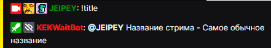
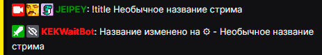

# Название ⁿᵉʷ

### Описание

Узнать название которое установленно на стриме.

## Использование комманды
 **`!title`**

## Пример использования

  

| Global cooldown | 10 seconds⠀⠀⠀⠀⠀⠀⠀⠀⠀⠀⠀|
|:----------------|:----------------------|
| User cooldown   | 0 seconds            |
| Mod only        | No                    |
| Sub only        | No                    |
| Vip only        | No                    |
| Другие варианты комманды        | !title !название              |
  

## Модерация

 **`!title TitleName`**

>- `TitleName` - Название для стрима

  

| Global cooldown | 10 seconds⠀⠀⠀⠀⠀⠀⠀⠀⠀⠀⠀|
|:----------------|:----------------------|
| User cooldown   | 0 seconds            |
| Mod only        | Yes                    |
| Sub only        | No                    |
| Vip only        | No                    |
| Другие варианты комманды        | !title !название             |
  

Last update on 02.01.2023
