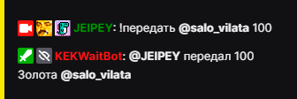

# Передать Золото

### Описание

Передать другому зрителю золото.

 **`!передать user amount`**

>- `user` - ник зрителя
>- `amount` - количество 

## Пример использования

  

| Global cooldown | 5 seconds⠀⠀⠀⠀⠀⠀⠀⠀⠀⠀⠀|
|:----------------|:----------------------|
| User cooldown   | 15 seconds            |
| Mod only        | No                    |
| Sub only        | No                    |
| Vip only        | No                    |
| Другие варианты комманды        | !give              |
  

Last update on 22.10.2022
