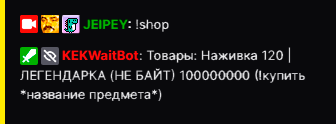

# Магазин

### Описание

Покупка разных предметов, которые будут храниться в [инвентаре](/KEKWaitBot/docs/info/inventory)

## Использование комманды
 **`!shop`**

 Просмотр товаров в магазине.

## Покупка предметов
 **`!shop *название предмета* *amount*`**

 - `amount` - количество

 Покупка предметов в магазине.

:::note

`amount` Можно не использлвать, в таком случае купится 1 предмет

:::
 
### Доступные предметы

- Наживка 120 Золота
- Магнит  750 Золота

## Пример использования

  

  

| Global cooldown | 0 seconds⠀⠀⠀⠀⠀⠀⠀⠀⠀⠀⠀|
|:----------------|:----------------------|
| User cooldown   | 3 seconds             |
| Mod only        | No                    |
| Sub only        | No                    |
| Vip only        | No                    |
| Другие варианты комманды        | !магазин !купить !buy !shop             |
  

Last update on 02.09.2023