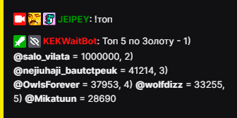
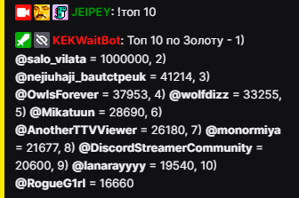
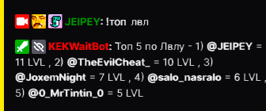

# Топ
### Описание

Узнать топ зрителей по золоту.

 **`!топ`**

## Пример использования

  

| Global cooldown | 20 seconds⠀⠀⠀⠀⠀⠀⠀⠀⠀⠀⠀|
|:----------------|:----------------------|
| User cooldown   | 0 seconds            |
| Mod only        | No                    |
| Sub only        | No                    |
| Vip only        | No                    |
| Другие варианты комманды        | !top              |
  

## Топ 10 по золоту

 **`!топ 10`**

  

| Global cooldown | 60 seconds⠀⠀⠀⠀⠀⠀⠀⠀⠀⠀⠀|
|:----------------|:----------------------|
| User cooldown   | 0 seconds            |
| Mod only        | No                    |
| Sub only        | No                    |
| Vip only        | Yes                    |
| Другие варианты комманды        | !top 10 !top10 !топ10             |
  

## Топ по уровню

:::info Восхождения учитываються в топе `1 восхождение = 100 LVL`

:::

 **`!топ лвл`**

## Пример использования

  

| Global cooldown | 20 seconds⠀⠀⠀⠀⠀⠀⠀⠀⠀⠀⠀|
|:----------------|:----------------------|
| User cooldown   | 0 seconds            |
| Mod only        | No                    |
| Sub only        | No                    |
| Vip only        | No                    |
| Другие варианты комманды        | !toplvl !top lvl !топлвл      |
  

Last update on 14.10.2022
